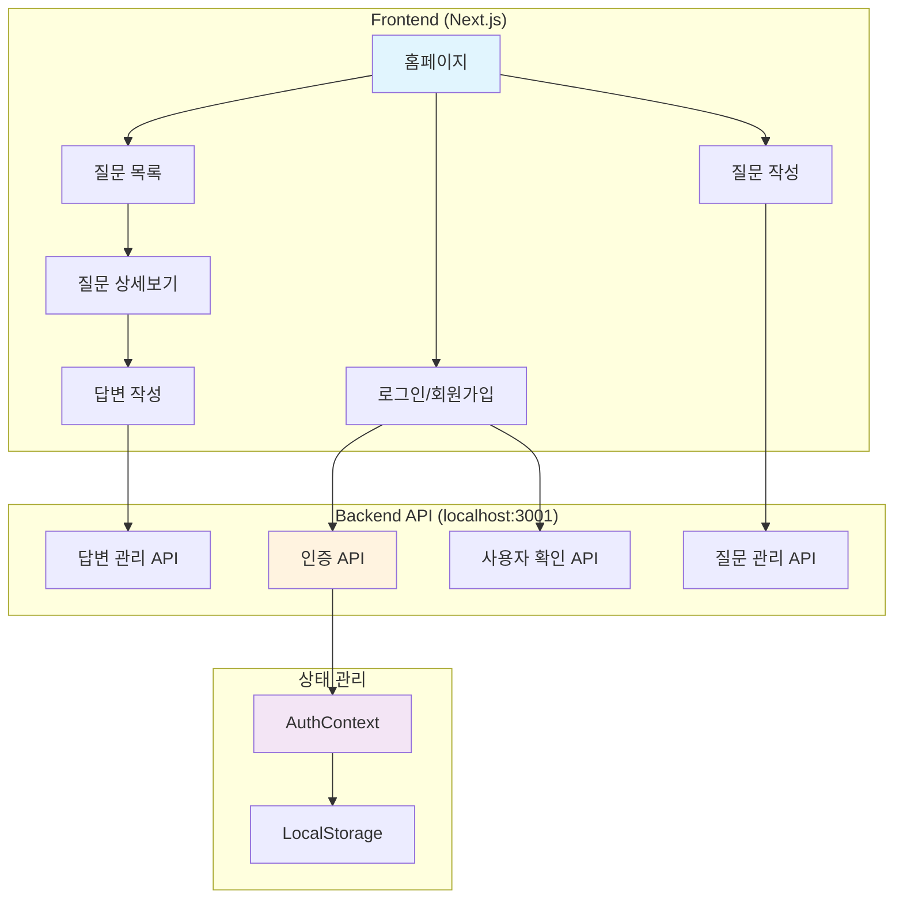
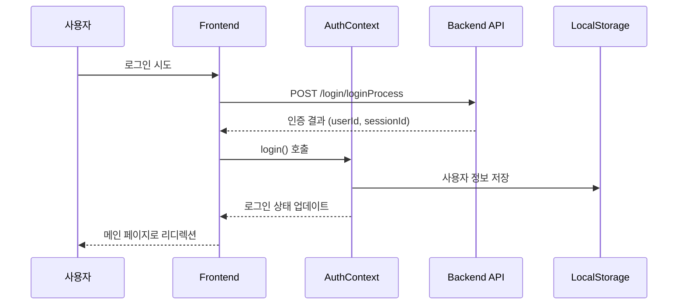
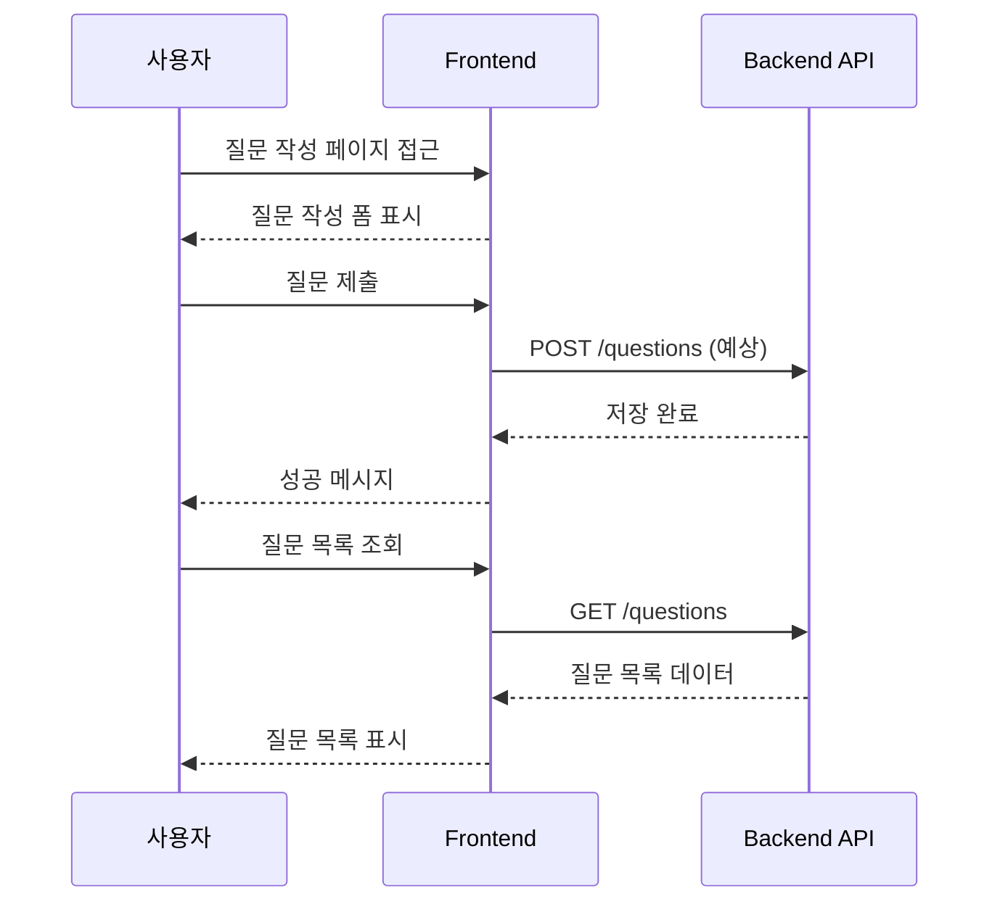
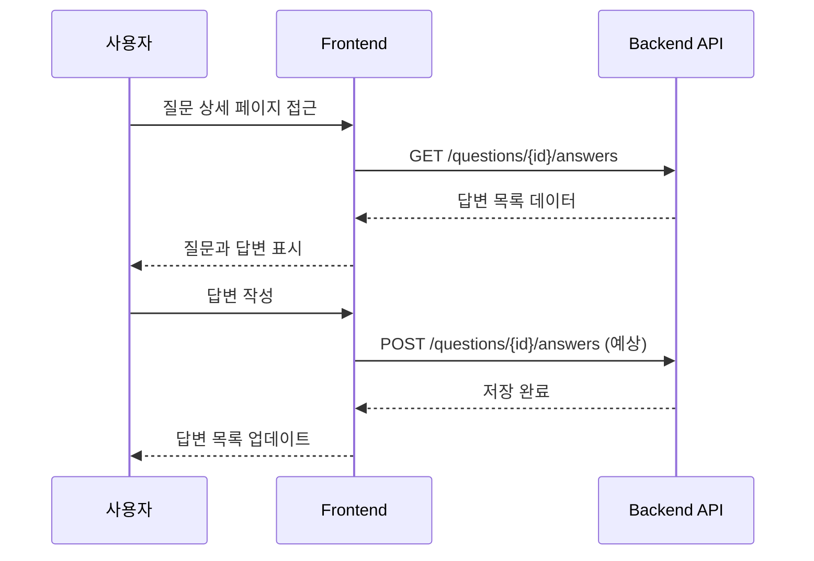
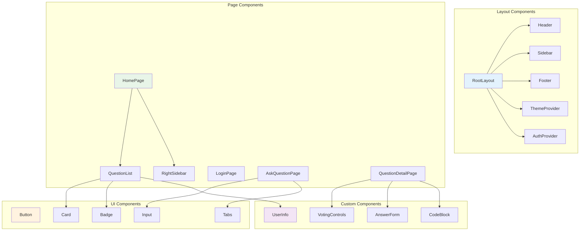
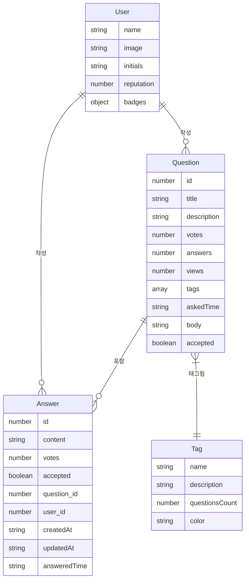
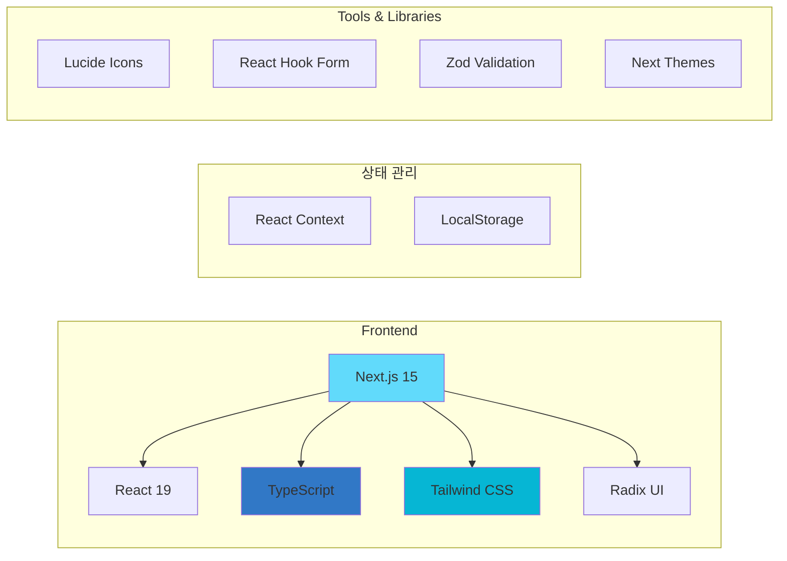

# DevForum 서비스 분석

## 서비스 개요
DevForum은 개발자 커뮤니티를 위한 Q&A 플랫폼으로, Next.js 기반의 웹 애플리케이션입니다.

## 시스템 아키텍처

## 주요 기능

### 1. 사용자 인증

### 2. 질문 관리

### 3. 답변 관리

## 컴포넌트 구조

## 데이터 모델

## API 엔드포인트

### 현재 구현된 API
- `POST /api/check-id` - 사용자 ID 중복 확인
- `POST /login/loginProcess` - 사용자 로그인
- `GET /questions` - 질문 목록 조회
- `GET /questions/{id}/answers` - 특정 질문의 답변 조회

### 예상 API (미구현)
- `POST /register` - 회원가입
- `POST /questions` - 질문 작성
- `POST /questions/{id}/answers` - 답변 작성
- `PUT/DELETE /questions/{id}` - 질문 수정/삭제
- `PUT/DELETE /answers/{id}` - 답변 수정/삭제

## 기술 스택

## 보안 고려사항

### 현재 구현
- 클라이언트 사이드 인증 상태 관리
- LocalStorage를 통한 세션 관리

### 개선 필요사항
- JWT 토큰 기반 인증 구현
- HTTPS 통신 강화
- XSS/CSRF 보호
- 입력 데이터 검증 강화

## 향후 개선 방향

1. **백엔드 API 완성**
   - 질문/답변 CRUD 완전 구현
   - 사용자 관리 시스템 구축

2. **실시간 기능**
   - WebSocket을 통한 실시간 답변 알림
   - 실시간 투표 결과 반영

3. **검색 기능**
   - 질문/답변 전문 검색
   - 태그 기반 필터링

4. **사용자 경험 개선**
   - 무한 스크롤
   - 오프라인 지원
   - PWA 구현